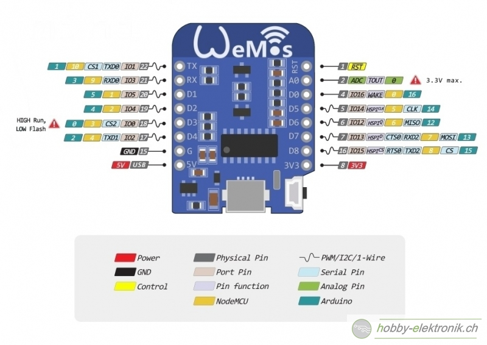
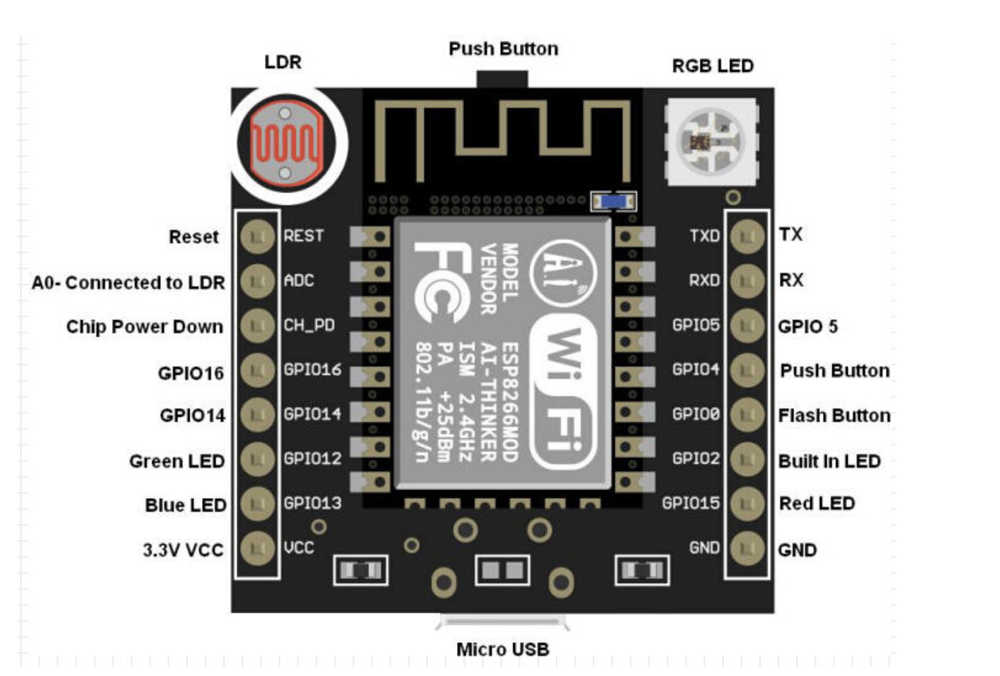
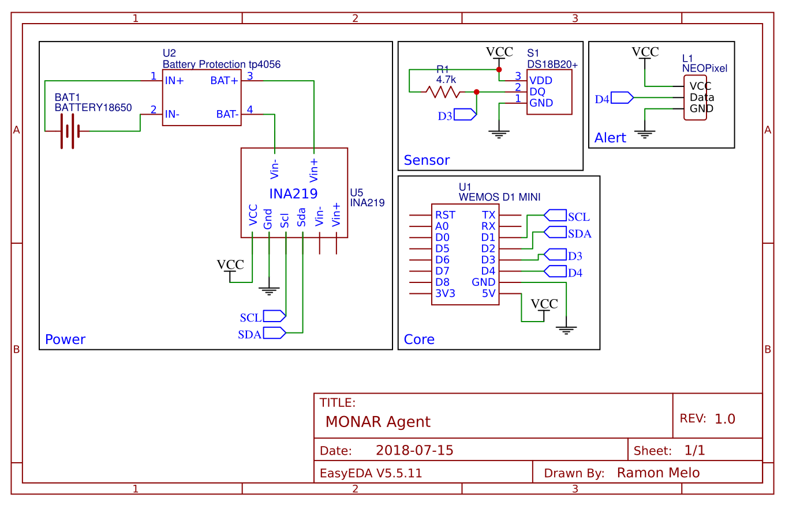

# Agent Description

# Basic Components:
- Wemos D1 Mini Pro
- Battery 18650
- [3D Case](https://cad.onshape.com/documents/cc92687d37542a6716c3775f/w/98ffa0c150c9c1ad592c8dd1/e/37cfc28d64b746a86401f5b0)
- DS18B20 Sensor
- Current Sensor [optional]
- Battery Charger Circuit TP4056 [optional]
- External Current Sensor [optional]

# Features:
- Wi-fi Enable
- I2C Communication Ports
- Deep Sleep + Low Energy
- Buzzer Alarm [optional]
- Led Alarm [optional]

# Boards:

# Schematics:

# Price

> Estimated value: R$ 73,00
